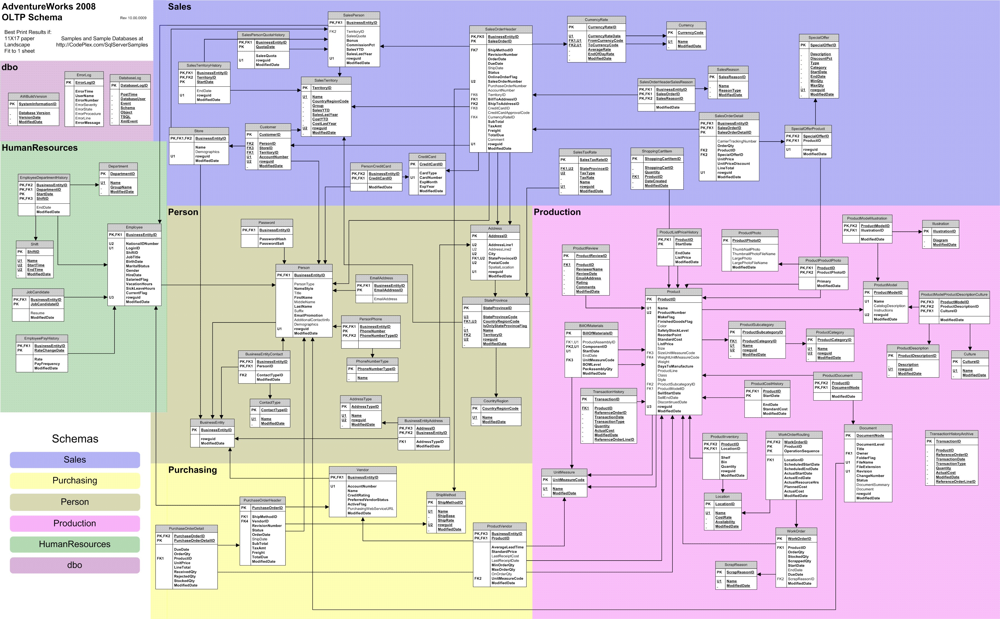
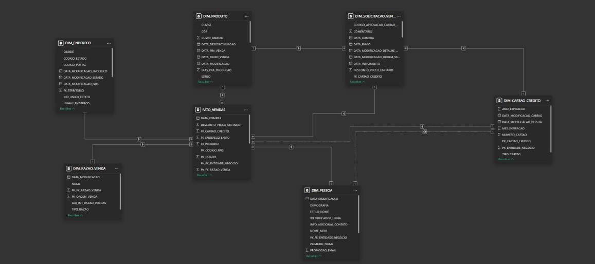

# AE_AW_GERALDOFONSECA
- Repositório utilizado para a obtenção de certificação de Analytics Engineer
## Desafio
Adventure Works (AW), uma indústria de bicicletas em franco crescimento que se orgulha de possuir mais de 500 produtos distintos, 20.000 clientes e 31.000 pedidos. Para manter seu ritmo de crescimento e se diferenciar da concorrência, a Adventure Works quer utilizar seus dados de forma estratégica, norteando suas decisões para se tornar uma empresa data driven. A diretoria da Adventure Works já listou uma série de perguntas que ela quer responder através de cruzamentos dos dados, e que devem guiar o desenvolvimento das tabelas de fatos e dimensões do data warehouse. Para iniciar o projeto e obter resultados rápidos, a opção foi iniciar pela área de vendas (sales), mas algumas tabelas de outras áreas podem ser necessárias para conseguir as informações desejadas. Em seu diagnóstico inicial, você identificou alguns sistemas que a Adventure Works utiliza e que geram dados relevantes para o negócio e que, em algum momento, devem fazer parte da infraestrutura de dados:

|Função|Sistema|
|----|----|
|ERP|SAP|
|CRM||Salesforce|
|Web Analytics|Google Analytics|
|Site|Wordpress|

Nas conversas iniciais, você também identificou que o projeto não é unanimidade dentro da empresa e que há dúvidas sobre o cronograma, custos envolvidos e se haverá retorno sobre o investimento realizado.

O projeto foi idealizado e patrocinado pelo diretor de inovação da AW, João Muller, e também tem apoio do CEO da empresa, Carlos Silveira, que vê no uso de dados um diferencial estratégico em longo prazo. Porém, na visão da diretora comercial, Silvana Teixeira, o valor investido no projeto poderia ter sido direcionado para ações promocionais que geram, em sua opinião, resultados de venda imediatos. Além disso, ela ainda não consegue enxergar como a criação de uma infraestrutura moderna de dados vai auxiliar em seu departamento comercial, já que promessas de tornar a área data driven, feitas por fornecedores de outros sistemas (como o CRM e Web Analytics), não conseguiram atingir os resultados prometidos.

Um pedido especial do CEO, Carlos Silveira, é que com a construção dessa plataforma de dados haja uma garantia da qualidade e veracidade dos dados de saída, ou seja, que time de Analytics Engineers consiga confirmar que a informação está de acordo com o levantado pela equipe de auditoria da contabilidade. Um exemplo que Carlos mencionou, foi de que as vendas brutas no ano de 2011 foram de $12.646.112,16. Portanto, ele gostaria que fossem realizados testes para garantir a veracidade desse valor nos modelos que serão construídos conforme um workshop do Modern Data Stack que ele assistiu recentemente.

Além dessas pessoas, o diretor de TI, Nilson Ramos, é responsável por garantir o acesso aos dados e indicou um analista, Gabriel Santos, para auxiliá-lo nesse acesso. Gabriel atualmente é responsável por administrar os bancos de dados e responder perguntas pontuais das áreas de negócio que necessitem o uso de SQL. Ele tem uma agenda bem limitada, então a coordenação da comunicação e a agilidade nas interações são essenciais para garantir que todos os dados necessários estejam disponíveis para o projeto.

### Impacto esperado

- Melhore a tomada de decisões
- A cultura de data driven comece a ser praticada em outros setores da empresa após a implantação do  dashboard para a tomada de decisão
- Criação de mais marts com pipeline moderno de dados construido com padrão feito no primeiro data mart criado para atender a área de vendas.

### Passos para a  solução
#### 1. ELT

 - Foi utilizado o dbt conecatado ao Snowflake e foi utilizada a base ADVENTURE_WORKS
 
    - Schema do banco transacional
 

 - Foi feita a extração e toda a configuração do ELT foi feita utilizando boas práticas.
    - Foi criada a primeira camada que é a staging para extrair os dados do banco transicional
    - Intermediate para a preparação dos dados para a criação dos fatos e dimensões
    - Marts que são as dimensões e fato criada para consumo de BI

- Foi criado testes para avaliar se havia duplicação e chave nulas, caso tive algum problema não seria carregado dados errados para os marts
 
 - Além dos testes de unicade e não nulo foi feito um teste para avaliar se a carga dos dados tinha sido feita corretamente. Fez o cálculo das vendas brutas no ano de 2011 e essa conta deveria ser de $12.646.112,16. Caso não obtesse esse valor era gerado um aviso de erro.

#### 2. Construção do dashboard
- Power BI foi conecatado ao Snowflake e consumiu as tabelas de dimensões e fatos do marts
 
  - Modelo star_schema
 

 - Foram respondidas as perguntas de negócio

    a - Qual o número de pedidos, quantidade comprada, valor total negociado por produto, tipo de cartão, motivo de venda, data de venda, cliente, status, cidade, estado e país?
  
    b - Quais os produtos com maior ticket médio por mês, ano, cidade, estado e país? (ticket médio = Faturamento bruto - descontos do produto / número de pedidos no período de análise)
    
    c - Quais os 10 melhores clientes por valor total negociado filtrado por produto, tipo de cartão, motivo de venda, data de venda, status, cidade, estado e país?
    
    d - Quais as 5 melhores cidades em valor total negociado por produto, tipo de cartão, motivo de venda, data de venda, cliente, status, cidade, estado e país?
    
    e - Qual o número de pedidos, quantidade comprada, valor total negociado por mês e ano (dica: gráfico de série de tempo)?
    
    f - Qual produto tem a maior quantidade de unidades compradas para o motivo de venda “Promotion”? 
### 3. Melhorias propostas
- Construção de um pipeline de CI/CD
- Treinar pessoas que passarão a ser referência na área para replicar o conhecimento.

### Conclusões

Apesar da resistência inicial da equipe, foi possível construir uma plataforma moderna de dados com um bom eda, dicionário de variáveis disponibilizado e apoio do CEO. A empresa conseguiu ver o comportamento dos clientes ao longo do tempo e conseguirá tomar decisões assertivs para 2015 com a análise de todo o histórico de vendas.

